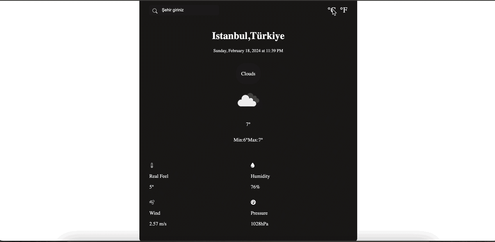

- API: https://openweathermap.org/current

1.Adım: util.js

-convertTimeStamp: Zaman dilimini kullanarak biçimlendirilmiş bir tarih ve saat bilgisini dönderen fonksiyon oluşturacağız. 

convertCountryCode: API'den gelen cevapta ülke koduna göre ülke adına çeviren fonksiyon oluşturacağız. 

2.Adım: api.js

-OpenWeather API'sine şehir, birim ve API anahtarı ile istekte bulunarak hava durumunu getiren fonksiyonu oluşturacağız.

3.Adım: ui.js

-API'den alınan hava durumu verilerini kullanarak kullanıcı arayüzünü güncelleyen fonksiyonu oluşturacağız. # WeatherApp

<h1> Weather App </h1>

This project is built using HTML5, CSS and JavaScript. It utilizes an API to fetch real-time weather data and display it to the user in a user-friendly interface. 

<h2> Features </h2>

<ul>

<li> Current Weather Display </li>  

The app provides the user with current weather conditions including temperature, humidity, wind speed, pressure and description of weather conditions. 

<li> Location-based Weather </li>  

By utilizing the user's location or allowing them to input a location, the app retrieves accurate weather data for their specified area. 

<li> Responsive Design </li>  

The app is designed to be responsive ensuring optimal viewing.

</ul>

<h2> Project Structure </h2>

<ul>

<li> api.js </li>  

This manages the interaction with the weather API, handling requests and responses.

<li> main.js </li>  

This orchestrates the overall functionality of the app, coordinating between different modules.

<li> ui.js </li>  

This handles the user interface elements and updates based on retrieved weather data.

<li> utils.js </li>  

This contains utility functions used throughout the project.

<li> weather.js </li>  

This defines the weather class and methods for processing weather data.

</ul>

<h2> Screen gif </h2>

